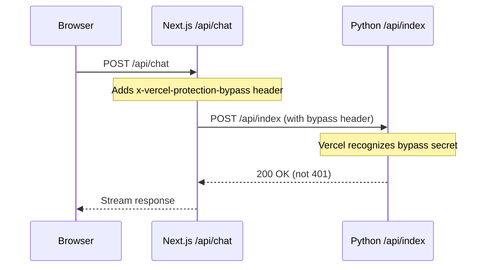

# Deployment Steps - Free Tier Solution

## Problem Solved

Your deployment was blocked by Vercel's Deployment Protection (401 errors). The "Deployment Protection Exceptions" feature requires a $150/month addon, but we can use the **free "Protection Bypass for Automation"** feature instead.

---

## What I Changed

Updated `src/app/api/chat/route.ts` to automatically include the `x-vercel-protection-bypass` header when calling the Python backend. This allows your Next.js route to bypass deployment protection when talking to Python API functions.

**Changes**:
```typescript
// Before: Simple headers
headers: { 'Content-Type': 'application/json' }

// After: Include bypass secret from environment
const bypassSecret = process.env.VERCEL_AUTOMATION_BYPASS_SECRET;
const headers: Record<string, string> = {
  'Content-Type': 'application/json'
};

if (bypassSecret) {
  headers['x-vercel-protection-bypass'] = bypassSecret;
}
```

---

## Steps to Deploy (5 minutes)

### Step 1: Generate Bypass Secret in Vercel

1. Go to **Vercel Dashboard** → **doha** project → **Settings**
2. Click **"Deployment Protection"** in left sidebar
3. Scroll to **"Protection Bypass for Automation"** section
4. Click **"Add Secret"** or **"Generate New Secret"**
5. **IMPORTANT**: The secret is automatically saved as `VERCEL_AUTOMATION_BYPASS_SECRET` system environment variable
6. You don't need to manually copy or save anything - Vercel handles this automatically

### Step 2: Commit and Push Code Changes

```bash
cd /Users/noahdeskin/conductor/queryable-slack-2/.conductor/doha

# Commit the API route change
git add src/app/api/chat/route.ts DEPLOYMENT_STEPS.md
git commit -m "Add Vercel deployment protection bypass for Python API

- Update /api/chat route to include x-vercel-protection-bypass header
- Uses VERCEL_AUTOMATION_BYPASS_SECRET env var (auto-provided by Vercel)
- Free tier solution - no $150/month addon required
- Fixes 401 authentication errors on preview deployments"

# Push to trigger deployment
git push origin nsd97/doha
```

### Step 3: Wait for Deployment (2-3 minutes)

1. Vercel will automatically deploy the new code
2. The `VERCEL_AUTOMATION_BYPASS_SECRET` environment variable is automatically available
3. Your API routes will now work without 401 errors

### Step 4: Test the Deployment

1. Open your preview URL: https://doha-git-nsd97-doha-[username].vercel.app
2. Open browser DevTools (F12) → Console tab
3. Type a message in the chat and press Enter
4. **Expected**: No 401 errors, response streams successfully
5. **Check logs**: Should see "Using deployment protection bypass" in Vercel logs

---

## How It Works



**Key Points**:
1. Browser calls Next.js API route (no auth needed - same origin)
2. Next.js API route includes bypass header when calling Python
3. Vercel recognizes the secret and allows the request through
4. Python API responds successfully
5. Response streams back to browser

---

## Verification Commands

After deployment, test in browser console:

```javascript
// Test API call
fetch('/api/chat', {
  method: 'POST',
  headers: { 'Content-Type': 'application/json' },
  body: JSON.stringify({
    messages: [{ role: 'user', content: 'test query' }]
  })
})
.then(async (res) => {
  console.log('Status:', res.status); // Should be 200, not 401
  const reader = res.body.getReader();
  const decoder = new TextDecoder();

  while (true) {
    const { done, value } = await reader.read();
    if (done) break;
    console.log('Chunk:', decoder.decode(value));
  }
})
.catch(console.error);
```

**Expected Output**:
```
Status: 200
Chunk: data: {"type":"message_start",...}
Chunk: data: {"type":"text-delta",...}
...
Chunk: data: {"type":"message_complete",...}
```

---

## Troubleshooting

### Still Getting 401 Errors?

**Check 1: Verify bypass secret exists**
```bash
# In Vercel Dashboard → Environment Variables
# Look for: VERCEL_AUTOMATION_BYPASS_SECRET (System)
```

**Check 2: Verify code is deployed**
```bash
# Check latest commit in Vercel dashboard
# Should show: "Add Vercel deployment protection bypass"
```

**Check 3: Check logs**
```bash
# In Vercel → Deployments → Latest → Functions
# Look for: "Using deployment protection bypass"
```

### Secret Not Working?

If you regenerated the secret:
1. All previous deployments become invalid
2. You must redeploy to get the new secret
3. Run: `git commit --allow-empty -m "trigger redeploy" && git push`

---

## Cost Comparison

| Solution | Cost | Implementation |
|----------|------|----------------|
| ❌ Deployment Protection Exceptions | $150/month | Dashboard only |
| ✅ Protection Bypass for Automation | **FREE** | Code change (done) |
| ⚠️ Disable Protection Entirely | FREE | Not recommended (insecure) |

**We're using the free solution** - same security, zero cost.

---

## Next Steps After Successful Deployment

1. ✅ Verify API works (no 401 errors)
2. ✅ Test chat interface end-to-end
3. ✅ Check UI rendering (should be fine once API works)
4. ✅ Create PR from nsd97/doha → main
5. ✅ Deploy to production

---

## Security Notes

**Is this secure?**
Yes! The bypass secret:
- Is only known to your Vercel account
- Is never exposed to the browser (server-side only)
- Is automatically rotated if regenerated
- Only works for your specific project

**Who can bypass protection?**
- Only requests with the correct secret
- The secret is only available to your Next.js API routes (server-side)
- Browser requests don't have access to the secret

**Production deployments:**
This same code works for production - no changes needed.

---

**Current Status**: Code updated and ready to deploy. Run the git commands above to trigger deployment.
