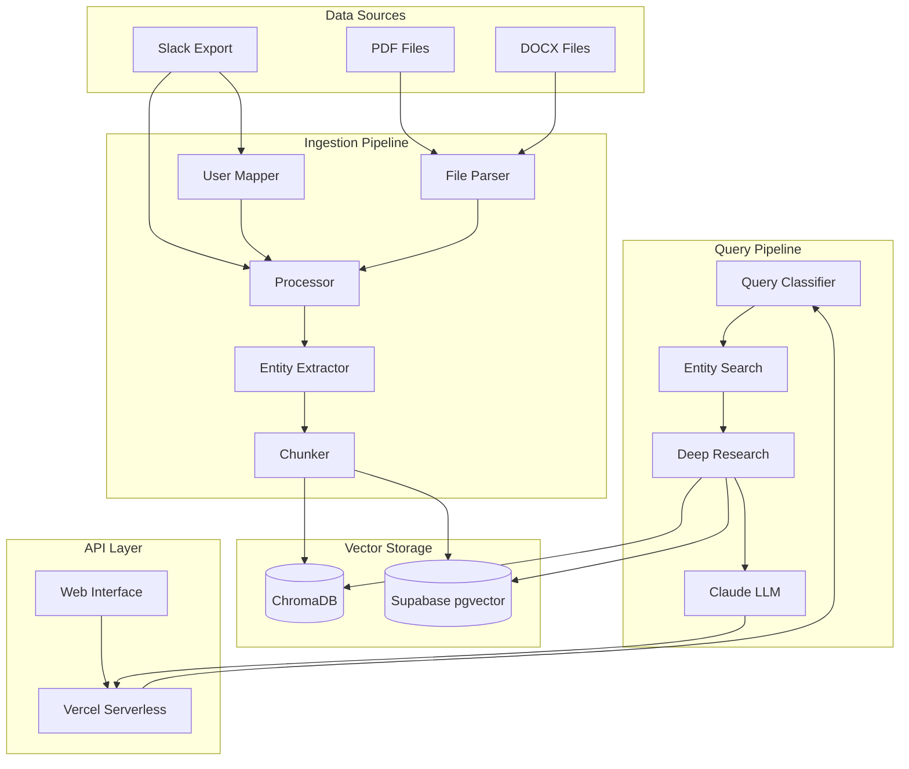
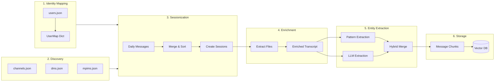
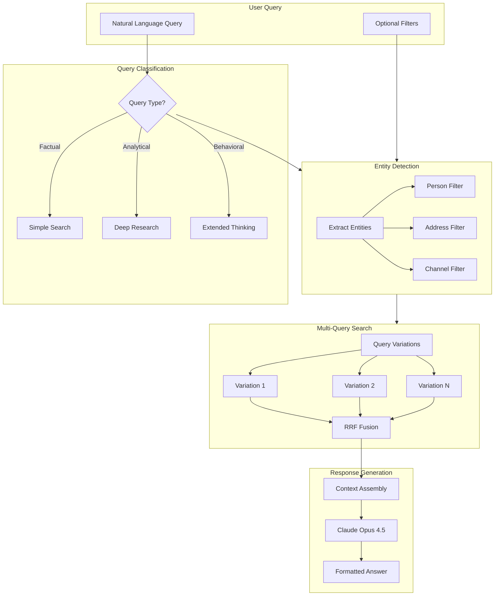
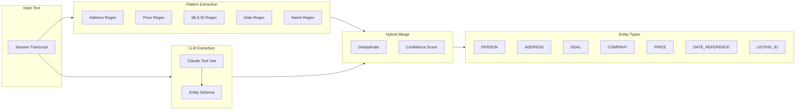

# Conductor - Real Estate AI Ingestion Engine

A production-grade pipeline that transforms raw Slack exports and local files into a queryable, semantic memory bank using Vector Search, Entity Extraction, and LLMs.

## Overview

Conductor ingests Slack conversation exports, extracts text from attached files (PDFs, DOCX, TXT), organizes conversations into time-based sessions, extracts entities (people, addresses, deals), and stores them in a vector database for semantic search. Query the system using natural language to find information across all conversations with optional entity-based filtering.

## Features

- **Strict Typing**: Pydantic v2 models at all I/O boundaries for type safety
- **Idempotent**: Re-running ingestion never creates duplicate vectors
- **Robust Error Handling**: Pipeline continues processing even when encountering bad data
- **Production Logging**: Structured logging throughout for observability
- **File Enrichment**: Automatically extracts text from PDF, DOCX, and TXT attachments
- **Sessionization**: Groups messages into conversation sessions based on 6-hour time gaps
- **Entity Extraction**: Hybrid LLM + pattern-based extraction of people, addresses, deals, prices
- **Message-Level Chunking**: Granular retrieval with message-level chunks
- **Semantic Search**: Vector-based similarity search using ChromaDB/Supabase
- **Entity Filtering**: Filter search results by person, address, or channel
- **LLM Integration**: Claude Opus 4.5 with extended thinking for analytical queries

## System Architecture

### High-Level Overview



### Ingestion Pipeline



### Query Pipeline



### Entity Extraction Flow



## Requirements

- **Python**: 3.11, 3.12, or 3.13 (Python 3.14 is not yet supported by ChromaDB)
- **Anthropic API Key**: Required for querying (set via `ANTHROPIC_API_KEY` environment variable)
- **Supabase**: Optional cloud vector storage (set `SUPABASE_URL` and `SUPABASE_ANON_KEY`)

## Quick Start

**New to the project?** See [ONBOARDING.md](ONBOARDING.md) for a complete setup guide.

**Opening from external hard drive?** See [OPEN_FROM_HARD_DRIVE.md](OPEN_FROM_HARD_DRIVE.md) for specific instructions.

1. **Clone the repository**:
   ```bash
   git clone https://github.com/ArchieOS-org/queryable-slack.git
   cd queryable-slack
   ```

2. **Install dependencies** (see Installation below)

3. **Set up API key** - Create `.env` file:
   ```bash
   cp .env.example .env
   # Edit .env and add your ANTHROPIC_API_KEY
   ```

4. **Run a trial** with a small subset:
   ```bash
   python -m conductor.trial_run /path/to/slack/export
   ```

5. **Test querying**:
   ```bash
   python -m conductor.ask "test question"
   ```

6. **If trial works, run full ingestion**:
   ```bash
   python -m conductor.ingest /path/to/slack/export
   ```

## Installation

### Using Virtual Environment (Recommended)

```bash
# Create virtual environment with Python 3.11-3.13
python3.12 -m venv venv

# Activate virtual environment
source venv/bin/activate  # On macOS/Linux
# OR
venv\Scripts\activate  # On Windows

# Install dependencies from requirements.txt
pip install --upgrade pip
pip install -r requirements.txt
```

**Alternative**: Install dependencies individually:
```bash
pip install pydantic chromadb anthropic langchain-community unstructured sentence-transformers supabase
```

### Using Poetry

```bash
poetry install
poetry shell
```

## API Usage

### Endpoints

| Endpoint | Method | Description |
|----------|--------|-------------|
| `/` | GET | API info and documentation |
| `/api/health` | GET | Health check with Supabase status |
| `/api/sessions` | GET | List sessions with optional channel filter |
| `/api/sessions/{id}` | GET | Get session details by ID |
| `/api/query` | POST | Semantic search with entity filtering |

### Query Endpoint

**POST /api/query**

```json
{
  "query": "What did EJ say about the 156 Seymour deal?",
  "match_count": 5,
  "person": "EJ",
  "address": "156 Seymour",
  "channel": null,
  "use_entity_detection": true
}
```

**Response:**

```json
{
  "answer": "Based on the archives...",
  "sources": [
    {"date": "2024-01-15", "channel": "deals", "message_count": 42}
  ],
  "query": "What did EJ say about the 156 Seymour deal?",
  "retrieval_count": 40,
  "classification": {
    "query_type": "analytical",
    "extended_thinking": false,
    "entities_detected": ["EJ", "156 Seymour"],
    "analysis_dimensions": ["communication", "deals"]
  },
  "entity_filters": {
    "person": "EJ",
    "address": "156 Seymour",
    "channel": null,
    "auto_detected": ["EJ"]
  }
}
```

## Project Structure

```
conductor/
├── __init__.py          # Package initialization
├── models.py            # Pydantic data models (UserMap, SlackMessage, Session, EnhancedVectorMetadata)
├── user_mapper.py       # Identity resolution (Bot vs Admin)
├── file_parser.py       # File extraction wrappers (PDF, DOCX, TXT)
├── processor.py         # Timeline stitching & sessionization logic
├── ingest.py            # Main orchestration entry point
├── ask.py               # CLI for querying the system
├── trial_run.py         # Trial run script for testing with subset of data
├── entity_extractor.py  # Hybrid entity extraction (LLM + pattern)
├── chunker.py           # Message-level chunking strategies
├── entity_search.py     # Entity-aware semantic search
├── query_classifier.py  # Query type classification
├── deep_research_query.py # Multi-query RRF fusion search
├── prompt_refiner.py    # System prompts for different query types
├── supabase_query.py    # Supabase vector search integration
└── reindex.py           # Script to add entity metadata to existing data

api/
├── index.py             # Vercel serverless API handler

supabase/
└── migrations/
    └── 20251126_add_entity_indexes.sql  # Entity filtering indexes

tests/                   # Pytest test suite
.env                     # Environment variables (API keys) - NOT in git
.env.example             # Example .env file template
```

## Entity Types

The system extracts and indexes the following entity types:

| Type | Description | Example |
|------|-------------|---------|
| `PERSON` | Agent names, client names, admin names | "EJ", "Mary Smith" |
| `ADDRESS` | Property addresses | "156 Seymour Ave" |
| `DEAL` | Transaction references, deal names | "Seymour Deal" |
| `COMPANY` | Brokerages, vendors, companies | "RE/MAX" |
| `LISTING_ID` | MLS numbers, internal listing IDs | "MLS W123456" |
| `PRICE` | Dollar amounts | "$1,250,000" |
| `DATE_REFERENCE` | Closing dates, deadlines | "Jan 15, 2024" |

## Data Models

### EnhancedVectorMetadata (New)

Extended metadata for entity-aware storage:
- `date`: ISO date string
- `channel`: Channel or conversation name
- `start_time` / `end_time`: Session boundaries
- `message_count` / `file_count`: Statistics
- `entities`: All entities as CSV string
- `person_mentions`: Comma-separated person names
- `address_mentions`: Comma-separated addresses
- `deal_mentions`: Comma-separated deal references
- `is_chunk`: Whether this is a message-level chunk
- `parent_session_id`: Parent session ID (for chunks)
- `chunk_index`: Position in parent session

### Session

Atomic unit of memory:
- `session_id`: Deterministic hash
- `start_time` / `end_time`: Session boundaries
- `channel_name`: Conversation identifier
- `conversation_type`: "channel", "dm", or "mpim"
- `transcript`: Pure text conversation
- `enriched_transcript`: Transcript + file content
- `file_count` / `message_count`: Statistics

## Reindexing Existing Data

To add entity metadata to existing sessions:

```bash
# Dry run (see what would change)
python -m conductor.reindex --dry-run

# Reindex ChromaDB with pattern extraction
python -m conductor.reindex --batch-size 50

# Reindex with LLM extraction (slower, more accurate)
python -m conductor.reindex --use-llm --batch-size 25

# Reindex Supabase
python -m conductor.reindex --supabase --batch-size 50
```

## Supabase Setup

To enable entity filtering in Supabase, apply the migration:

```bash
# In Supabase SQL Editor, run:
supabase/migrations/20251126_add_entity_indexes.sql
```

This creates:
- GIN index on metadata JSONB
- Expression indexes on entity fields
- `match_conductor_sessions_with_entities()` RPC function

## Configuration

### Environment Variables

| Variable | Required | Description |
|----------|----------|-------------|
| `ANTHROPIC_API_KEY` | Yes | Claude API key for LLM queries |
| `AI_GATEWAY_API_KEY` | Yes | Vercel AI Gateway key for embeddings |
| `SUPABASE_URL` | No | Supabase project URL |
| `SUPABASE_ANON_KEY` | No | Supabase anonymous key |
| `SUPABASE_SERVICE_KEY` | No | Supabase service key (for reindexing) |

### ChromaDB Storage

- Default location: `./conductor_db/`
- Collection name: `conductor_sessions`
- Embedding model: `sentence-transformers/all-MiniLM-L6-v2` (384 dimensions)

## Development

### Running Tests

```bash
pytest tests/
```

### Type Checking

```bash
mypy conductor/
```

### Linting

```bash
ruff check conductor/
```

### Code Style

- Type hints required for all functions
- Pydantic models for all I/O boundaries
- Structured logging with appropriate levels
- Error handling that never crashes the pipeline

## Troubleshooting

### Python Version Issues

If you see ChromaDB import errors, ensure you're using Python 3.11-3.13:
```bash
python3.12 --version  # Should show 3.12.x
```

### Entity Extraction Issues

If entities aren't being detected:
- Check that `use_entity_detection` is `true` in API requests
- For short names like "EJ", ensure the regex pattern matches
- Run reindex to add entity metadata to existing sessions

### Supabase RPC Function Missing

If entity filtering fails, ensure the migration was applied:
```sql
SELECT proname FROM pg_proc WHERE proname = 'match_conductor_sessions_with_entities';
```

## License

[Add your license here]

## Author

Noah Deskin
